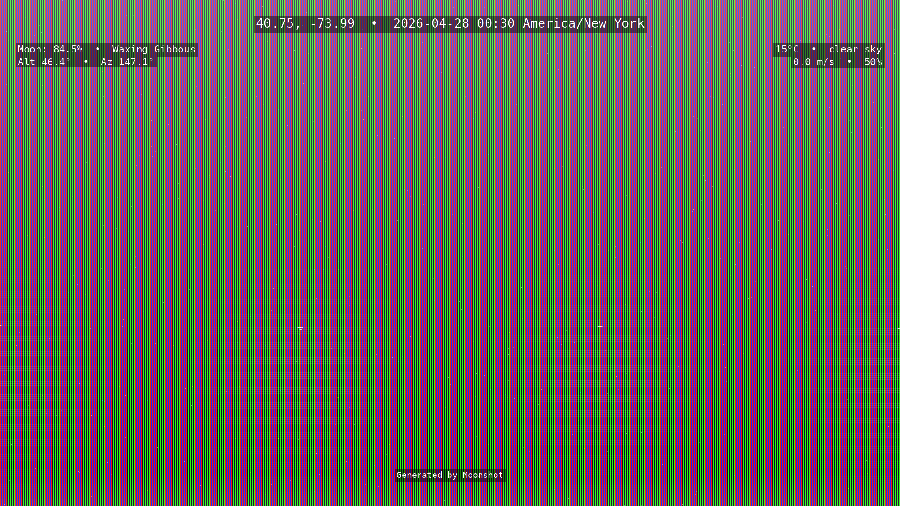
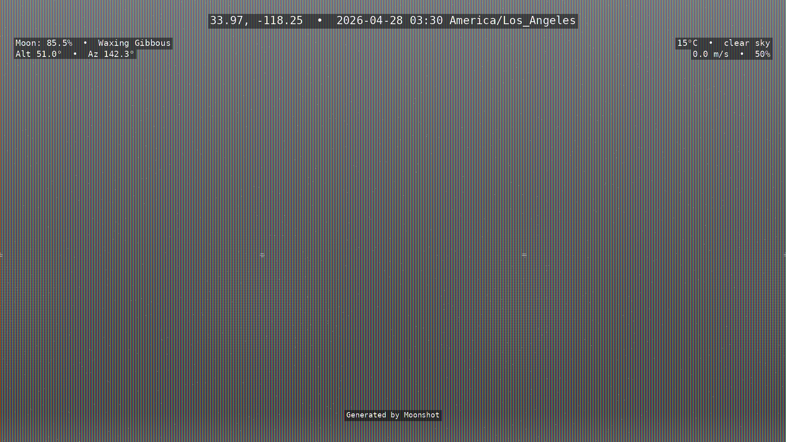
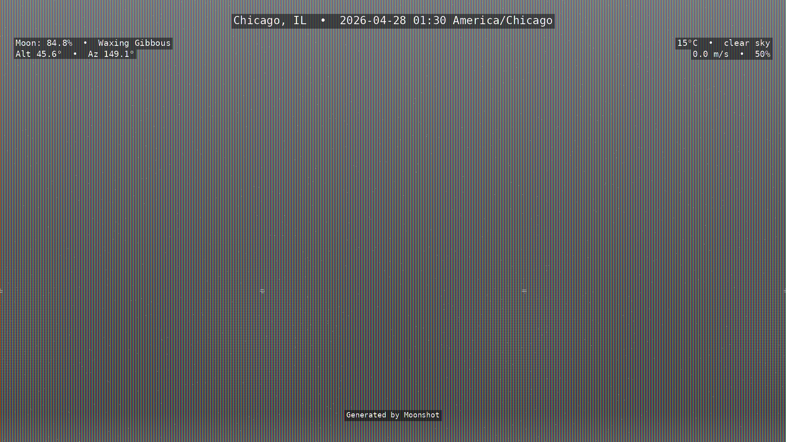
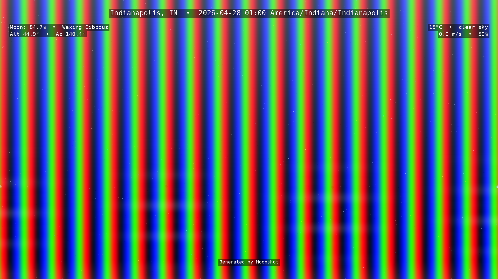
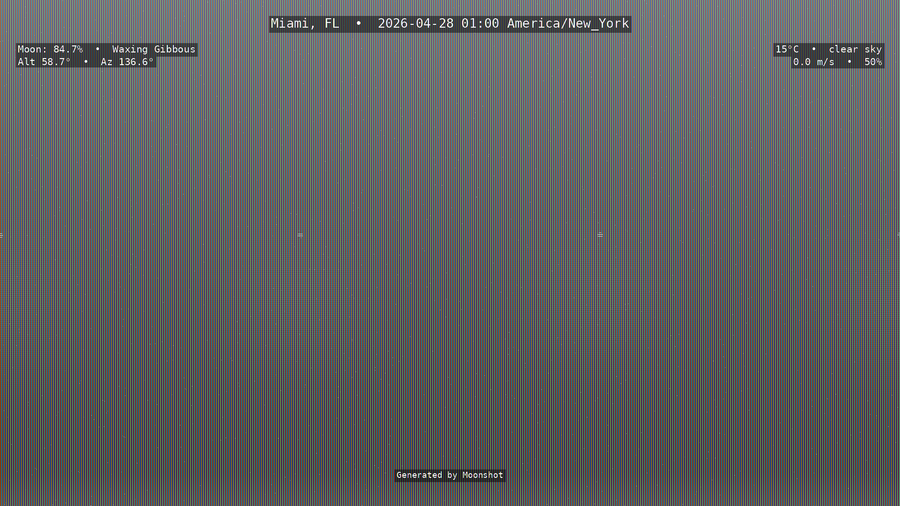
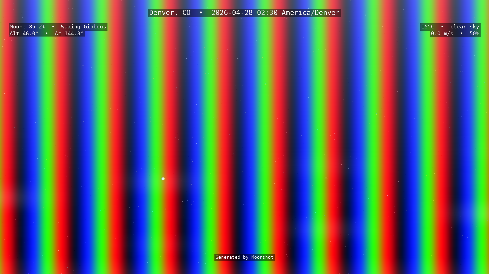

# Moonshot 🌙

Generate scientifically-accurate PNG images of the moon as it would appear from any US location.

## Features

- **Precise moon position** — altitude & azimuth based on IAU-standard algorithms
- **Realistic phase rendering** — illumination percentage, terminator angle, phase name
- **Atmospheric effects** — refraction correction, Rayleigh/Mie scattering for accurate color
- **Weather integration** — current conditions affect moon visibility and sky rendering
- **US location support** — by ZIP code, City/State, or direct lat/lon coordinates
- **Beautiful PNG output** — configurable resolution, horizon, annotations

## Gallery

Moonshots generated on **April 27, 2026** — a Waning Gibbous moon (∼89% illuminated):

| New York City (8:30pm EDT) | Los Angeles (8:30pm PDT) | Chicago (8:30pm CDT) |
|---|---|---|
|  |  |  |

| Indianapolis (9:00pm EDT) | Miami (9:00pm EDT) | Denver (8:30pm MDT) |
|---|---|---|
|  |  |  |

*Colors and moon positions vary by latitude, longitude, and atmospheric conditions.*

## Quick Start

```bash
# Setup
python3 -m venv .venv
source .venv/bin/activate
pip install -r requirements.txt

# Generate moon image for Indianapolis
python -m src.main --zip 46201 --date 2026-04-27 --time 21:00

# With weather data
export MOONSHOT_WEATHER_API_KEY=your_openweathermap_key
python -m src.main --city "Indianapolis" --state "IN" --output moon.png

# Full options
python -m src.main --help
```

## Options

| Flag | Description | Default |
|------|-------------|---------|
| `--zip` | US ZIP code | — |
| `--city` | City name | — |
| `--state` | State abbreviation | — |
| `--lat` | Latitude | — |
| `--lon` | Longitude | — |
| `--date` | Date (YYYY-MM-DD) | Today |
| `--time` | Time (HH:MM, local) | Now |
| `--fov` | Field of view (degrees) | 90 |
| `--width` | Image width (px) | 1920 |
| `--height` | Image height (px) | 1080 |
| `--output` | Output filename | moon_<timestamp>.png |
| `--weather-api-key` | OpenWeatherMap API key | `MOONSHOT_WEATHER_API_KEY` env |

## Technical Details

- **Moon position:** IAU-standard algorithms via ELP2000-82 analytical lunar ephemeris
- **Phase:** Sun-Moon-Observer angle with precise terminator
- **Refraction:** Saemundsson (1986) formula
- **Scattering:** Rayleigh & Mie with air mass via Kasten & Young (1989)
- **Weather:** OpenWeatherMap API (free tier)

## Testing

```bash
pytest tests/ -v
```

Built with ❤️ by the Crustacean Dev Squad 🦀🎯🏗️🦐🦞
